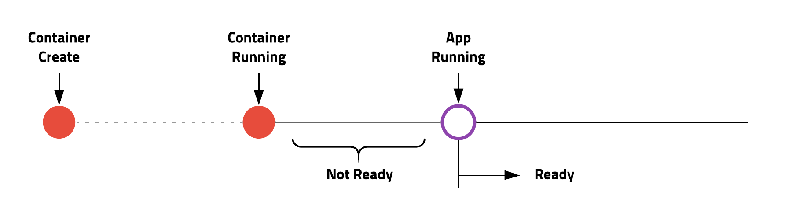

# Pod

## 빠른 예제

```sh
kubectl run whoami --image subicura/whoami:1 # deprecated soon..
  "pod/whoami created" --> 'n/w가 연결되지 않은 container가 실행되었다.'
kubectl get po
kubectl get pod
kubectl get pods 
kubectl get pods -o wide  # --> 어느 node에 pod가 떠 있는지 확인 가능.
kubectl get pods -o yaml
kubectl get pods -o json
kubectl logs whoami-<xxxx>  # --> api 서버로 모아주기 때문에 다른 서버의 log도 확인 가능하다.
kubectl logs -f whoami-<xxxx>
kubectl exec -it whoami-<xxxx> sh   # proxy형태로 container에 접속
kubectl describe pods whoami-<xxxx> # 'Events' 내용(생성이력)이 중요함( ex.실행을 했는데, pod이 뜨지 않는 경우 해당 이력을 확인 )
kubectl delete pods whoami-<xxxx>
kubectl get pods
kubectl get all
kubectl delete deployment/whoami  
  # 실제 'kubectl run whoami...'를 실행해 보면 pod만 생성되고 deployment가 생성되지 않음. 버전차이??
```

## YAML 파일 예제

```
kubectl apply -f <filename>
kubectl delete -f <filename>
```

### 기본 예제

guide-03/task-02/whoami-pod.yml

```yml
apiVersion: v1
kind: Pod
metadata:
  name: whoami
  labels:
    type: app
spec:
  containers:
  - name: app
    image: subicura/whoami:1
 
 # ~/project/guide-03/task-02$ kubectl apply -f whoami-pod.yml
 # pod/whoami created
```

### Pod Ready



### livenessProbe 예제 (살아 있는지 조사)

guide-03/task-02/whoami-pod-lp.yml

```yml
apiVersion: v1
kind: Pod
metadata:
  name: whoami-lp
  labels:
    type: app
spec:
  containers:
  - name: app
    image: subicura/whoami:1
    livenessProbe:
      httpGet:
        path: /not/exist
        port: 8080
      initialDelaySeconds: 5
      timeoutSeconds: 2 # Default 1
      periodSeconds: 5 # Defaults 10
      failureThreshold: 1 # Defaults 3
```

### readinessProbe 예제 (준비가 되었는지 조사)

guide-03/task-02/whoami-pod-rp.yml

```yml
apiVersion: v1
kind: Pod
metadata:
  name: whoami-rp
  labels:
    type: app
spec:
  containers:
  - name: app
    image: subicura/whoami:1
    readinessProbe:
      httpGet:
        path: /not/exist
        port: 8080
      initialDelaySeconds: 5
      timeoutSeconds: 2 # Default 1
      periodSeconds: 5 # Defaults 10
      failureThreshold: 1 # Defaults 3
```

### health check 예제

guide-03/task-02/whoami-pod-health.yml

```yml
apiVersion: v1
kind: Pod
metadata:
  name: whoami-health
  labels:
    type: app
spec:
  containers:
  - name: app
    image: subicura/whoami:1
    livenessProbe:
      httpGet:
        path: /
        port: 4567
    readinessProbe:
      httpGet:
        path: /
        port: 4567
```

### multi container 예제

guide-03/task-02/whoami-pod-redis.yml

```yml
apiVersion: v1
kind: Pod
metadata:
  name: whoami-redis
  labels:
    type: stack
spec:
  containers:
  - name: app
    image: subicura/whoami-redis:1
    env:
    - name: REDIS_HOST
      value: "localhost"
  - name: db
    image: redis
```


```
kubectl get all
kubectl logs whoami-redis
kubectl logs whoami-redis app
kubectl logs whoami-redis db
kubectl exec -it whoami-redis
kubectl exec -it whoami-redis -c db sh
kubectl exec -it whoami-redis -c app sh
  apk add curl busybox-extras # install telnet
  curl localhost:4567
  telnet localhost 6379
    dbsize
    KEYS *
    GET count
    quit
kubectl get pod/whoami-redis
kubectl get pod/whoami-redis -o yaml
kubectl get pod/whoami-redis -o jsonpath="{.spec.containers[0].name}"
kubectl get pod/whoami-redis -o jsonpath="{.spec.containers[*].name}"
kubectl describe pod/whoami-redis
```

## Exam 1. 다음 조건을 만족하는 pod을 만들어 보세요.

guide-03/task-02/exam-1.yml

- Name: mongodb
- Labels: app => mongo
- Container Name: mongodb
- Image: mongo:4

## Exam 2. 다음 조건을 만족하는 pod을 만들어 보세요.

guide-03/task-02/exam-2.yml

- Name: mysql
- Labels: app => mysql
- Container Name: mysql
- Image: mysql:5.6
- Env
  - MYSQL_ROOT_PASSWORD: 123456

POD에 접속해서 mysql -uroot -p123456 으로 테스트

## 정리

```
kubectl delete -f ./
```
